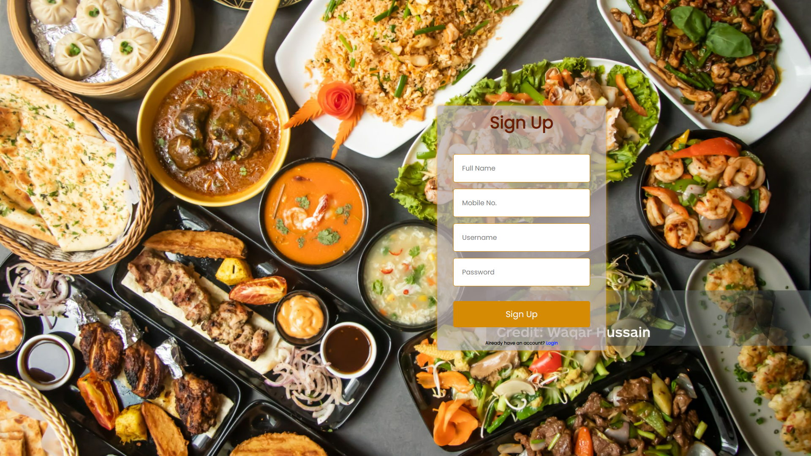
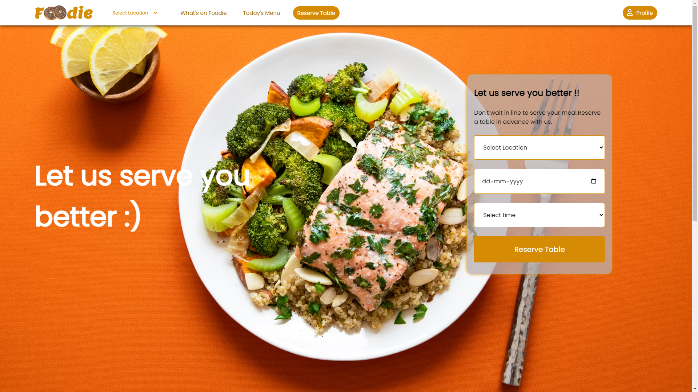
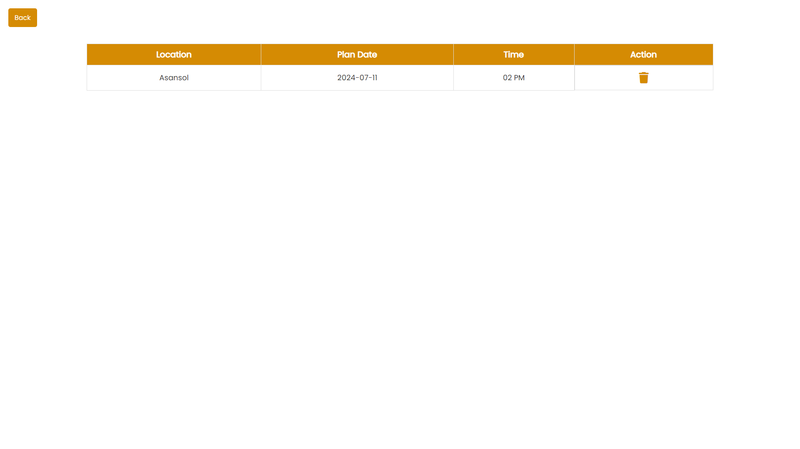

# Foodie - Ultimate Restaurant Table Reservation Website

Foodie is the ultimate restaurant table reservation website for food enthusiasts. This project leverages Java technology to provide a seamless experience for reserving tables at your favorite restaurants.

## Technologies Used

- **Java**: Core backend logic
- **JSP**: JavaServer Pages for dynamic web content
- **MySQL**: Database management
- **Tomcat Server**: Web server
- **Cookies and Sessions**: For user data storage and session management
- **CSS**: Styling the website
- **JavaScript**: Basic interactivity and functionality

## Features

- User-friendly interface for table reservations
- Secure user sessions and data management
- Responsive design with CSS
- Dynamic content rendering with JSP
- Reliable data storage with MySQL

## Getting Started

### Prerequisites

- Java Development Kit (JDK)
- Apache Tomcat Server
- MySQL Server
- Eclipse IDE (or any preferred Java IDE)

### Installation

1. Clone the repository:
    ```sh
    git clone https://github.com/your-username/foodie.git
    ```

2. Open the project in your IDE.

3. Configure the Tomcat server in your IDE.

4. Set up the MySQL database:
    ```sql
    CREATE DATABASE foodie_db;
    -- Run the SQL scripts provided in the `sql/` directory to set up the tables and initial data
    ```

5. Modify the database configuration in the project to match your MySQL setup.

6. Deploy the project on the Tomcat server.

### Collaborator

This Project was made in collaboration with Bratya Roy ```Bratya2021```

## Screenshots






# Foodie
